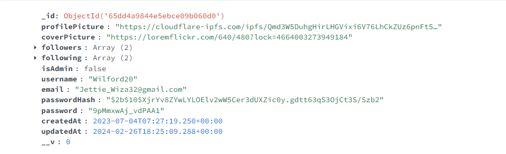
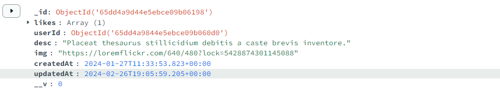
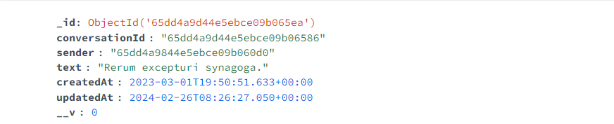
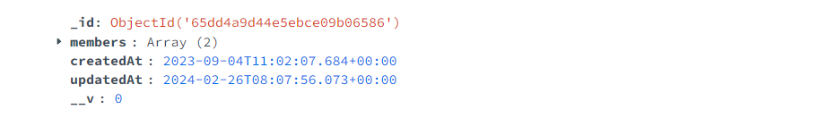

# Chat Project Data Base 2

Este proyecto es una red social que permite a los usuarios chatear y compartir posts. El proyecto está dividido en dos partes: el frontend y el backend.
El frontend esta desarrollado en React JS y el backend con Express utilizando una base de datos MongoDB.

## Frontend

### Instalación

Para instalar las dependencias del frontend, navega al directorio `frontend` y ejecuta el siguiente comando:

```bash
cd frontend
yarn install
yarn start
```

## Backend

### Instalación

Para instalar las dependencias del frontend, navega al directorio `backend` y ejecuta el siguiente comando:

```bash
cd backend
yarn install
yarn start
```

### Base de Datos MONGODB

Las colecciones utilizadas para el proyecto fueron las siguientes:
- users:
  
- posts:
  
- messages:
  
  
- conversations:
  
